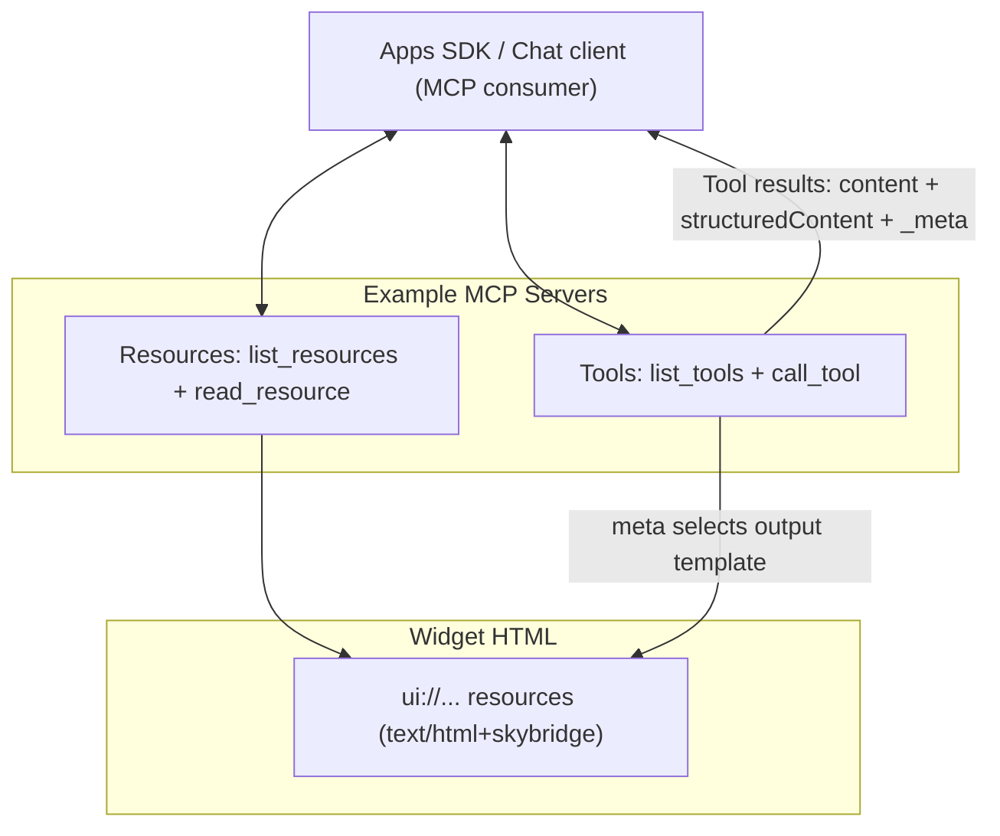

# openai-apps-examples — API Contracts & Schemas

## Overview

This repository is an examples gallery for the OpenAI Apps SDK. Each example is implemented as an **MCP server** that exposes:

- **Tools** (callable functions) with contracts defined by **JSON Schema** (`inputSchema`)
- **Widget resources** (HTML) served as MCP **resources**, which the Apps SDK can render inline

There is **no OpenAPI or GraphQL spec** in this repo. The “API contracts” are defined directly in each server via:
- Tool descriptors (including `inputSchema`)
- Tool call results (`content`, optional `structuredContent`, and `_meta` used for rendering)

---

## MCP surfaces used

Across the example servers, the MCP protocol is used primarily through:

- `list_tools` — advertises tools and their `inputSchema`
- `call_tool` — runs a tool and returns a result
- `list_resources` / `read_resource` — serves widget HTML resources

The details of the wire format are provided by the MCP SDKs; the repo primarily controls **tool schemas** and **tool/resource payload shapes**.

---

## Tool result shape (what tools return)

Tool execution returns an MCP tool result that typically includes:

- `content`: an array of content blocks (commonly text) for user-visible output
- `structuredContent` (optional): a machine-readable payload used by widgets for hydration
- `_meta` (optional): metadata consumed by the Apps SDK (commonly used to connect a tool result to a widget template and customize invocation UI strings)

This repo’s examples generally use `_meta` to tell the Apps SDK which widget to render (see next section).

---

## Widget resources (HTML) via MCP resources

Example servers also serve widget HTML as MCP resources.

**Typical pattern:**
- A widget is identified by a `ui://...` URI.
- The resource payload uses:
  - `uri`
  - `mimeType` (commonly `text/html+skybridge` in these examples)
  - `text` containing the HTML document contents

**Representative resource shape:**
```json
{
  "uri": "ui://widget/kitchen-sink-lite.html",
  "mimeType": "text/html+skybridge",
  "text": "<!doctype html>..."
}
```

Where the HTML comes from and how it is built/loaded is server-specific, but the contract exposed over MCP is the resource shape above.

---

## `_meta` conventions used for widget rendering

Many tools in this repo include `_meta` fields that the Apps SDK uses to render widgets and label tool calls in the UI.

Commonly used fields include:

- `openai/outputTemplate`: a `ui://...` URI pointing to a widget HTML resource
- `openai/toolInvocation/invoking`: text displayed while a tool runs
- `openai/toolInvocation/invoked`: text displayed after completion
- `openai/widgetAccessible`: boolean flag used by the examples to mark the widget as accessible

Some examples also demonstrate maintaining widget continuity across turns using:

- `openai/widgetSessionId`: a server-provided session identifier intended to keep widget state stable across tool calls within the same “session” concept defined by the example.

---

## Tool contracts by example

The sections below describe the tool input and output shapes as they are documented in this repo’s example servers. Where the implementation differs between Node and Python examples, that is called out explicitly.

### Kitchen Sink Lite

#### Tool: `kitchen-sink-show`

**Input schema (JSON Schema):**
```json
{
  "type": "object",
  "properties": {
    "message": { "type": "string", "description": "Message to render in the widget." },
    "accentColor": { "type": "string", "description": "Optional accent color (hex)." },
    "details": { "type": "string", "description": "Optional supporting copy to show under the headline." }
  },
  "required": ["message"],
  "additionalProperties": false
}
```

**Validation approach (implementation detail):**
- Node examples validate inputs with Zod.
- Python examples validate inputs with Pydantic models (exported to JSON Schema).

**Result shape (high level):**
- `content`: a text summary for the chat surface
- `structuredContent`: a widget payload used by the HTML template

**Structured content (documented example shape):**
```json
{
  "message": "string",
  "accentColor": "string or null",
  "details": "string or null",
  "fromTool": "kitchen-sink-show"
}
```

> Note: Keep widget-side expectations aligned with what the server actually returns. If one implementation adds extra fields, widgets should either ignore unknown fields or you should standardize the payload.

---

#### Tool: `kitchen-sink-refresh`

**Input schema (JSON Schema):**
```json
{
  "type": "object",
  "properties": {
    "message": { "type": "string", "description": "Message to echo back." }
  },
  "required": ["message"],
  "additionalProperties": false
}
```

**Result shape (high level):**
- `content`: a short text response
- `structuredContent`: a widget payload indicating the refresh action

---

### Pizzaz tools

These examples share a common input shape across multiple tools.

**Tools:**
- `pizza-map`
- `pizza-carousel`
- `pizza-albums`
- `pizza-list`
- `pizza-shop`

**Input schema (JSON Schema):**
```json
{
  "type": "object",
  "properties": {
    "pizzaTopping": {
      "type": "string",
      "description": "Topping to mention when rendering the widget."
    }
  },
  "required": ["pizzaTopping"],
  "additionalProperties": false
}
```

**Result shape (typical):**
- `content`: short tool-specific text
- `structuredContent`:
```json
{ "pizzaTopping": "string" }
```

Tools typically set `_meta.openai/outputTemplate` to select the appropriate widget template.

---

### Shopping cart

#### Tool: `add_to_cart`

**Input schema source:**
- Generated from Pydantic (JSON Schema exported at runtime).

**Effective input shape (as documented):**
```json
{
  "type": "object",
  "properties": {
    "items": {
      "type": "array",
      "items": {
        "type": "object",
        "properties": {
          "name": { "type": "string", "description": "Name of the item to show in the cart." },
          "quantity": { "type": "integer", "minimum": 1, "default": 1 }
        },
        "required": ["name"]
      }
    },
    "cartId": {
      "type": ["string", "null"],
      "description": "Existing cart identifier. Leave blank to start a new cart."
    }
  },
  "required": ["items"],
  "additionalProperties": false
}
```

**Result `structuredContent` (documented example shape):**
```json
{
  "cartId": "string",
  "items": [
    { "name": "string", "quantity": 1 }
  ]
}
```

**Widget session:**
- The example uses `_meta["openai/widgetSessionId"]` to associate tool results with a cart session identifier.

---

### Solar system

#### Tool: `focus-solar-planet`

**Input schema (JSON Schema, as documented):**
```json
{
  "type": "object",
  "properties": {
    "planetName": { "type": "string", "default": "Earth" },
    "autoOrbit": { "type": "boolean", "default": true }
  },
  "additionalProperties": false
}
```

**Result `structuredContent` (documented example shape):**
```json
{
  "planet_name": "Earth",
  "planet_description": "string",
  "autoOrbit": true
}
```

**Interoperability note:**
The documented payload mixes naming conventions (`planet_name` vs `autoOrbit`). If your widget expects one consistent style, either normalize server output or handle both field styles in the widget code.

---

### Authenticated server (OAuth demo)

This example demonstrates tool metadata related to authentication and OAuth-style guidance for clients.

#### Tool: `search_pizza_sf`

**Input schema (JSON Schema):**
```json
{
  "type": "object",
  "title": "Search terms",
  "properties": {
    "searchTerm": { "type": "string", "description": "Optional text to echo back in the response." }
  },
  "required": [],
  "additionalProperties": false
}
```

#### Tool: `see_past_orders`

**Input schema (JSON Schema):**
```json
{
  "type": "object",
  "title": "Past orders",
  "properties": {
    "limit": { "type": "integer", "minimum": 1, "maximum": 20 }
  },
  "required": [],
  "additionalProperties": false
}
```

#### Auth-related metadata (as demonstrated)

- Tool descriptors demonstrate `securitySchemes` metadata (including a mix of `noauth` and `oauth2` depending on the tool).
- Error results can include `_meta["mcp/www_authenticate"]` to provide `WWW-Authenticate`-style guidance to clients.

> This document avoids pinning exact route paths or endpoint strings unless they are explicitly part of the public contract you intend to support. If the repo relies on a specific well-known path, document it directly from the code/README and keep it consistent.

---

## Error responses (what to expect)

### Node servers
- Input validation errors are typically raised by the validation layer (e.g., Zod) and become MCP error responses handled by the SDK/transport.
- Unknown tools/resources are typically represented as thrown errors.

Because the exact wire error envelope is SDK-dependent, client code should be prepared to handle MCP error responses rather than relying on a custom JSON shape.

### Python servers
A common pattern is to return a tool result with:

```json
{
  "content": [{ "type": "text", "text": "Invalid input: ..." }],
  "isError": true
}
```

The authenticated example may also attach auth guidance via `_meta`, for example:

```json
{
  "_meta": {
    "mcp/www_authenticate": ["[TOKEN_REDACTED_d049c699]=\"...\""]
  },
  "isError": true
}
```

---

## Versioning

This repo does not define an explicit contract versioning system (for example, URL prefixes like `/v1`). In practice, compatibility is governed by:

- The tool `inputSchema` currently advertised by `list_tools`
- The widget resource URI and HTML contents
- Any server version strings exposed via the MCP server configuration (when present)

If you need stronger guarantees, consider introducing a simple “contract version” field in tool metadata or publishing schema snapshots (see Recommendations).

---

## Architecture (logical view)



This diagram focuses on the contracts a developer interacts with:
- tool schemas and tool results
- widget resource URIs and HTML content

---

## Build & configuration notes (repo-level)

- Widget assets are built into an `assets/` directory and served by MCP servers via `read_resource`.
- Python servers are commonly run under an ASGI server during development (exact invocation depends on the example).
- Some Python examples demonstrate transport security configuration via environment variables (used to configure transport security settings).

> Keep operational/runbook details (ports, local serve commands, etc.) in the repo’s README or per-example docs so this document can stay focused on contracts.

---

## Key files (orientation)

| File/Directory | Purpose |
|---|---|
| `kitchen_sink_server_node/src/server.ts` | Node MCP example: tools + resources for kitchen sink widget |
| `pizzaz_server_node/src/server.ts` | Node MCP example: pizzaz tools + resources |
| `kitchen_sink_server_python/main.py` | Python MCP example: kitchen sink tools + resources |
| `pizzaz_server_python/main.py` | Python MCP example: pizzaz tools + resources |
| `shopping_cart_python/main.py` | Python MCP example: shopping cart tool + widget session usage |
| `solar-system_server_python/main.py` | Python MCP example: solar system tool + widget rendering metadata |
| `authenticated_server_python/main.py` | Python MCP example: authentication-related metadata patterns |
| `src/` | Widget source code (front-end) |
| `assets/` | Built widget HTML resources served via MCP |

---

## Recommendations

1. **Standardize `structuredContent` naming conventions**
   - Pick camelCase or snake_case and apply it consistently across servers and widgets.
   - If you need backwards compatibility, consider emitting both temporarily and deprecating one.

2. **Publish a contracts snapshot**
   - During build, export each tool’s `inputSchema` and (optionally) a JSON example of `structuredContent`.
   - This makes it easier for widget authors and client code to stay aligned with server behavior.

3. **Make error handling consistent for widgets**
   - Even if MCP-level errors vary by SDK, you can standardize widget-facing error information via `structuredContent` (e.g., `{ code, message, details }`) when returning `isError: true`.

---